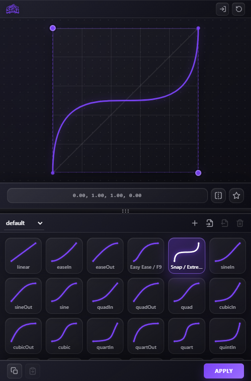

# SoriGraph

Flow-style cubic-bezier easing panel for Adobe After Effects.



SoriGraph is a CEP extension for applying, reading, copying, and saving After Effects temporal easing presets with a visual cubic-bezier graph. It is built for motion designers who want Flow-like easing behavior in a lightweight panel.

## Features

- Visual cubic-bezier editor with draggable handles.
- Apply easing presets to selected keyframes.
- Read selected keyframe easing back into the graph.
- Copy and paste selected keyframe ease.
- Import, export, create, and delete preset libraries.
- Flow-compatible easing math for AE temporal ease influence and speed.
- Supports regular numeric properties, separated dimensions, spatial properties, effect controls, speed ramps, Twixtor-style values, and other plugin properties that expose editable temporal keyframes.
- Skips unsupported AE property value types safely, such as markers, text documents, layer indexes, mask indexes, custom values, and no-value groups.

## Compatibility

The manifest targets After Effects `16.0` and newer, covering AE 2019 through current CEP-based AE versions.

SoriGraph applies easing through AE's native `KeyframeEase`, `setTemporalEaseAtKey`, and keyframe interpolation APIs, so the same apply logic is used for native properties and third-party effect properties when those properties support editable temporal keyframes.

## Install

1. Copy this folder to your Adobe CEP extensions folder:

   ```text
   C:\Users\<you>\AppData\Roaming\Adobe\CEP\extensions\sori
   ```

2. If unsigned CEP extensions are not enabled, enable debug mode for your CEP version.

3. Restart After Effects.

4. Open `Window > Extensions > SoriGraph`.

## Usage

1. Select two or more keyframes in After Effects.
2. Pick or edit a cubic-bezier curve in SoriGraph.
3. Click `APPLY`.
4. Use the read button to pull the selected keyframe easing back into the graph.
5. Save useful curves as presets or export the preset library.

## Development

Core files:

- `panel/index.html` - CEP panel markup.
- `panel/css/` - panel styling.
- `panel/js/app.js` - graph UI, presets, CEP bridge, and client-side easing helpers.
- `panel/jsx/main.jsx` - After Effects ExtendScript apply/read/copy/paste logic.
- `CSXS/manifest.xml` - CEP manifest and AE compatibility range.

Useful checks:

```powershell
node --check panel\js\app.js
node --check panel\js\csinterface.js
Get-Content panel\jsx\main.jsx | Select-Object -Skip 2 | node --check
```

## Notes

SoriGraph intentionally does not clamp temporal ease speed by a fixed maximum. This keeps high-value plugin properties, speed ramps, and Twixtor-style properties consistent when reading and applying the same bezier values.
